<p align="center">
  
</p>

<p align="center">
  
  
  
  
  
</p>

<p align="center">
  <a href="https://github.com/danielroods/PvZ-StrawHats">
    <strong>🐙 Personal GitHub Repository</strong>
  </a>
  &nbsp; • &nbsp;
  <a href="https://github.com/advanced-progamming-sut-2026/phase-0-strawhats">
    <strong>🎓 Course Repository</strong>
  </a>
</p>

<p align="center">
  <a href="https://github.com/danielroods/PvZ-StrawHats/releases/latest">
    
  </a>
  &nbsp;
  <a href="https://github.com/advanced-progamming-sut-2026/phase-0-strawhats/releases/latest">
    
  </a>
</p>

<p align="center">
  <a href="https://strawhats.github.io/PvZ_StrawHats/"><strong>🌻 View the live interactive showcase →</strong></a>
</p>

> A full recreation of Plants vs. Zombies 2, built from scratch in Java with a layered MVC architecture and LibGDX graphics — spanning terminal-based core logic (Phase 1) to a complete graphical experience (Phase 2).

---

This project belongs to the Straw Hat pirates...
As the king of the pirates and his right and left wings, we will smash the sea and its freaking zombies?
mmm... maybe!

---

## 🎥 Demo Video

<p align="center">
  <a href="PVZ_Strawhats_trailer.mov">
    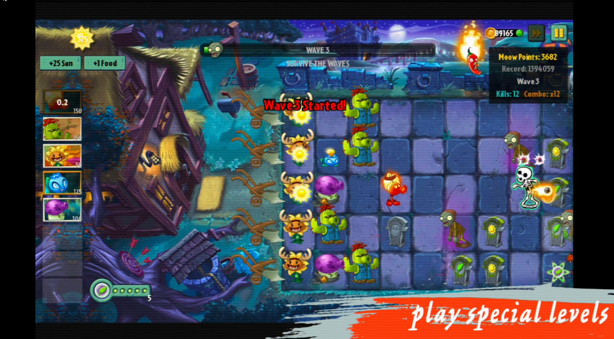
  </a>
</p>

<p align="center">
  <a href="PVZ_Strawhats_trailer.mov"><strong>▶ Watch the gameplay demo</strong></a>
</p>

---

## 🖼️ Screenshots

<table>
  <tr>
    <td align="center">
      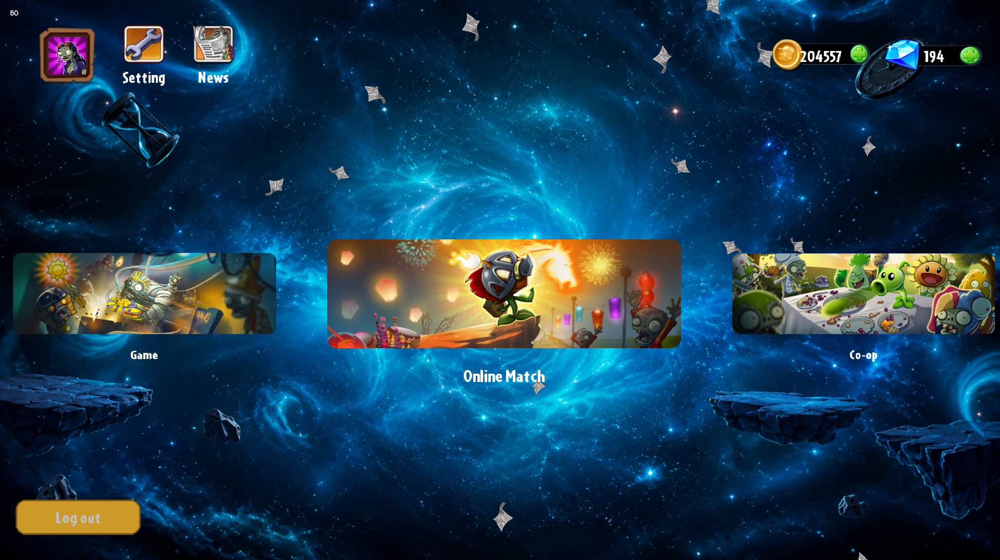
    </td>
    <td align="center">
      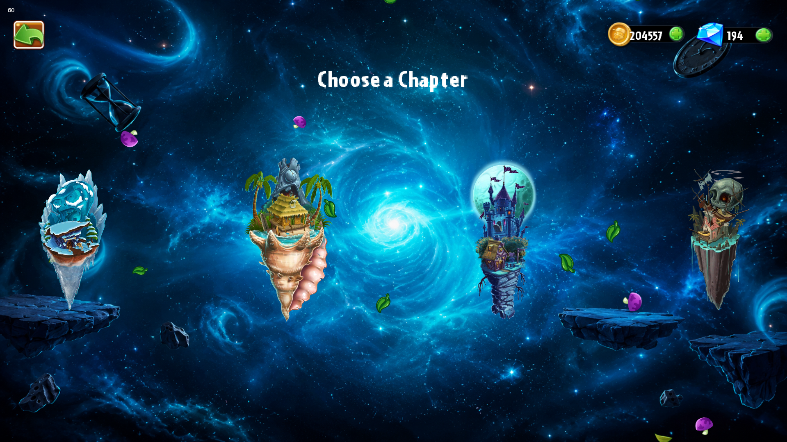
    </td>
  </tr>
  <tr>
    <td align="center">
      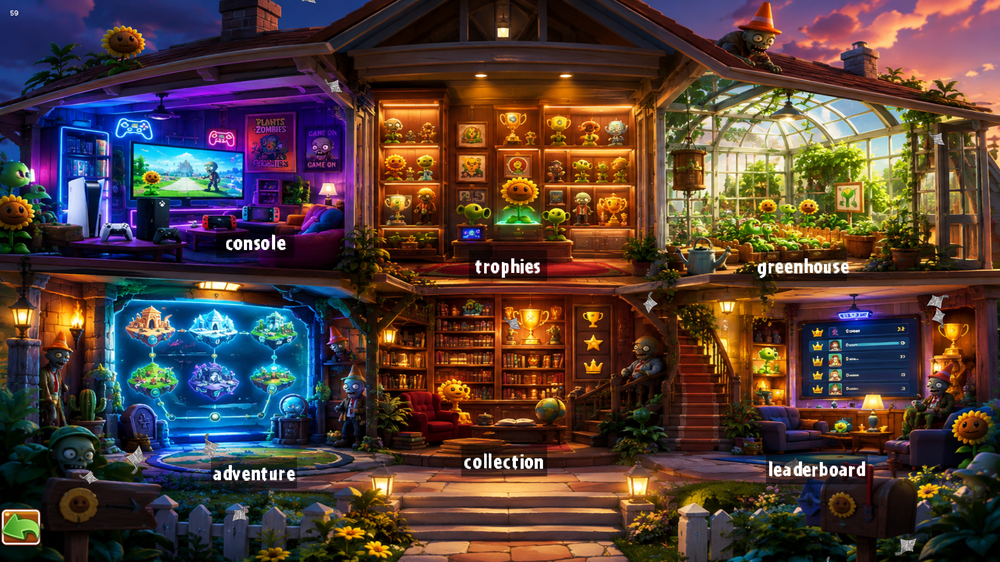
    </td>
    <td align="center">
      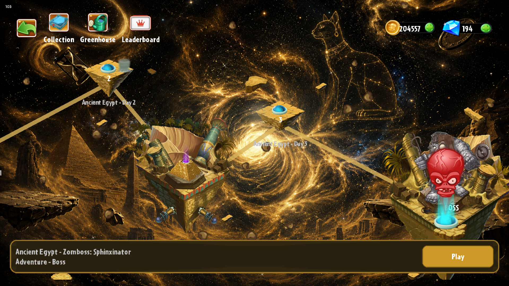
    </td>
  </tr>
  <tr>
    <td align="center">
      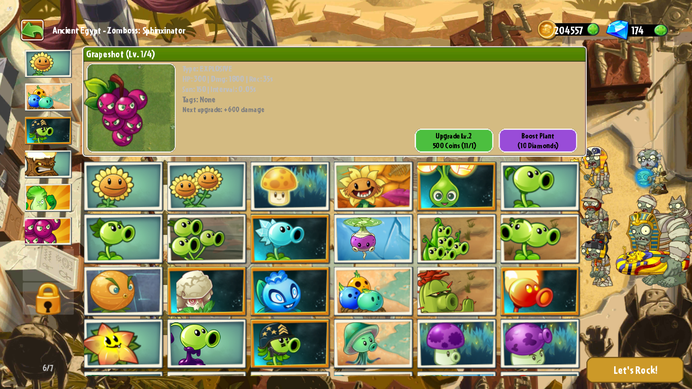
    </td>
    <td align="center">
      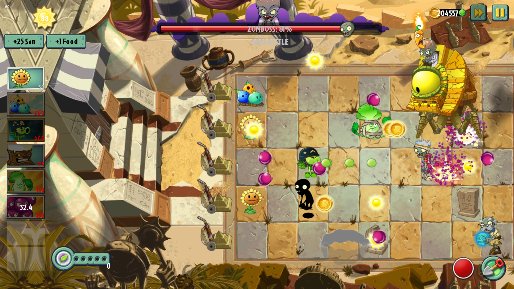
    </td>
  </tr>
  <tr>
    <td align="center">
      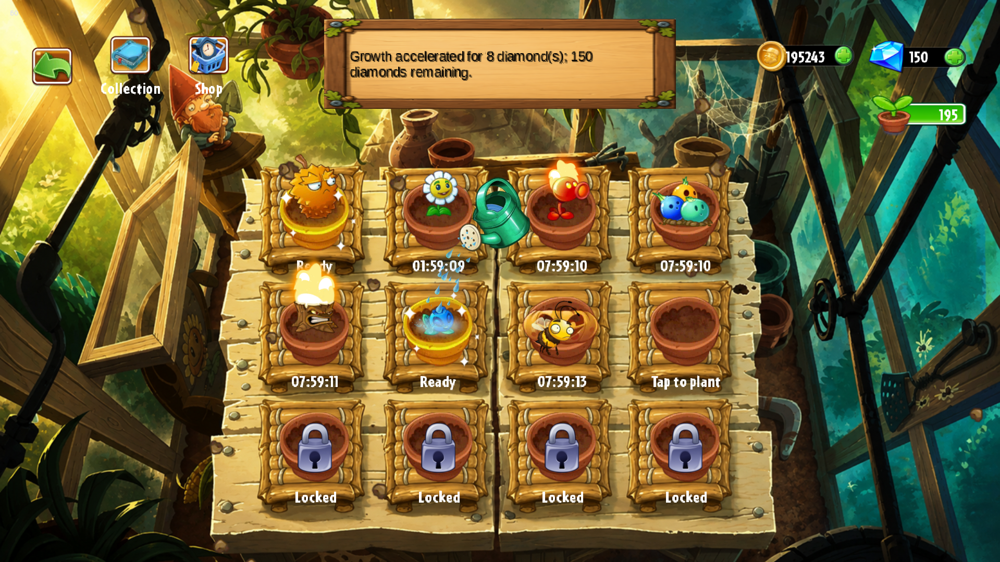
    </td>
    <td align="center">
      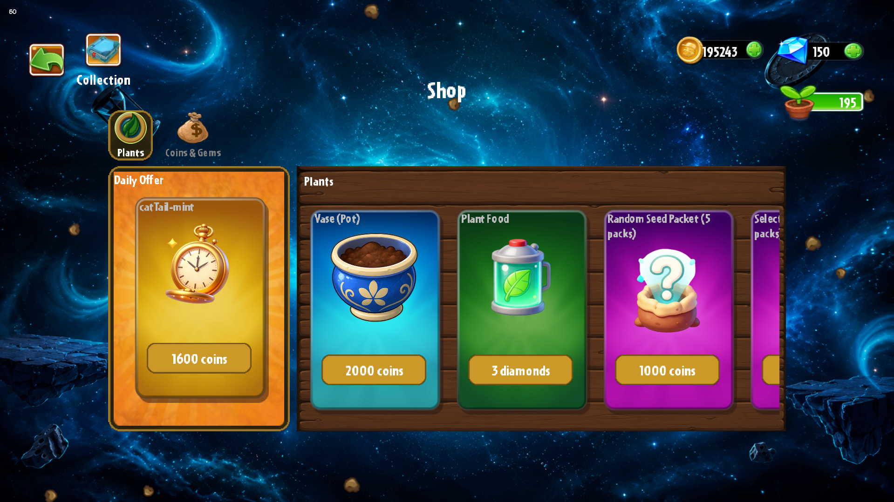
    </td>
  </tr>
  <tr>
    <td align="center">
      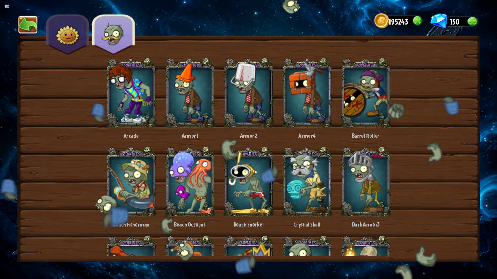
    </td>
    <td align="center">
      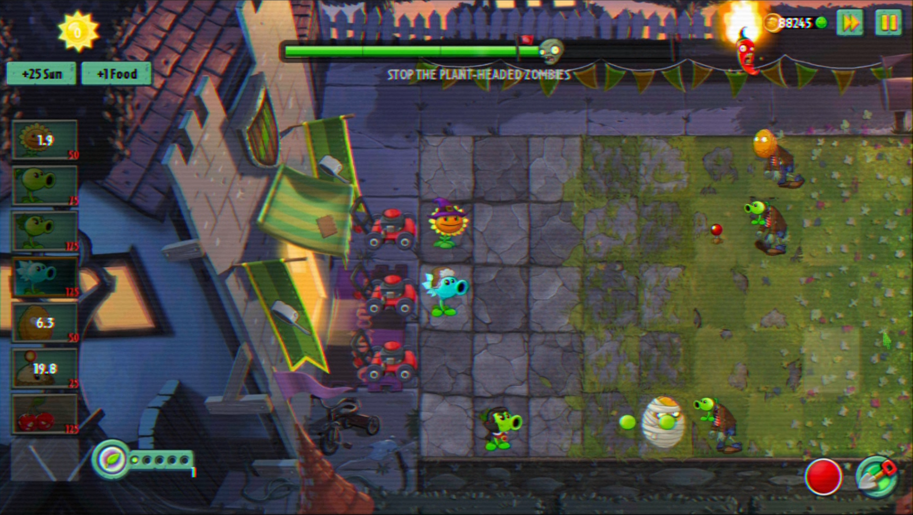
    </td>
  </tr>
  <tr>
    <td align="center">
      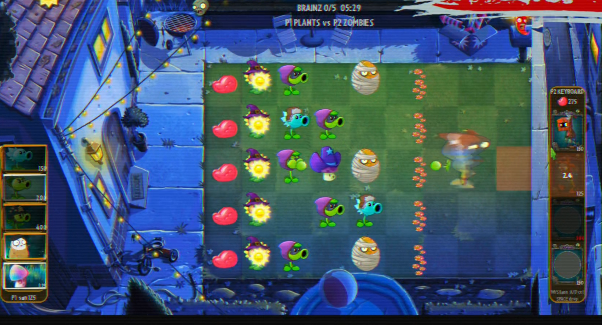
    </td>
    <td align="center">
      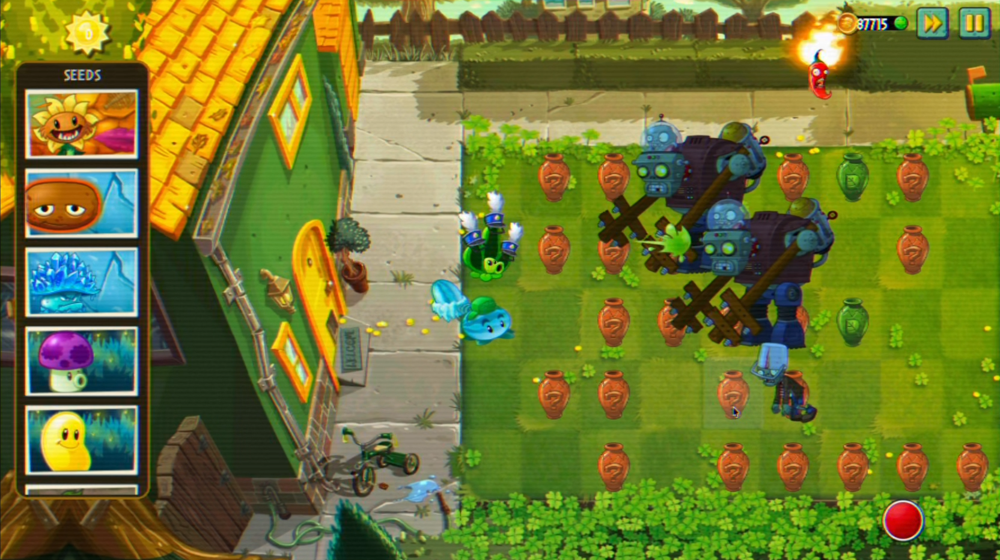
    </td>
  </tr>
  <tr>
    <td align="center">
      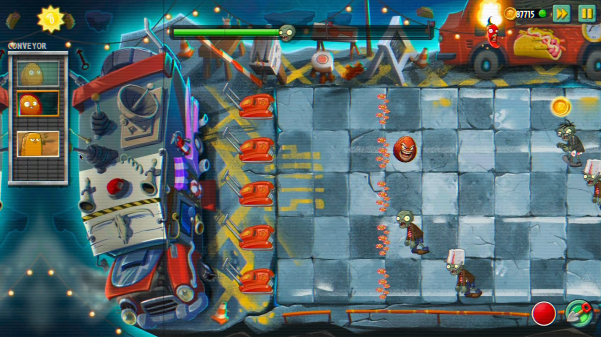
    </td>
    <td align="center">
      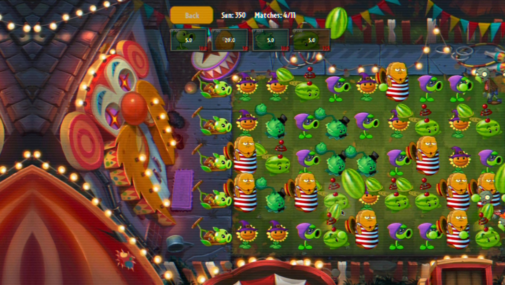
    </td>
  </tr>
  <tr>
    <td align="center">
      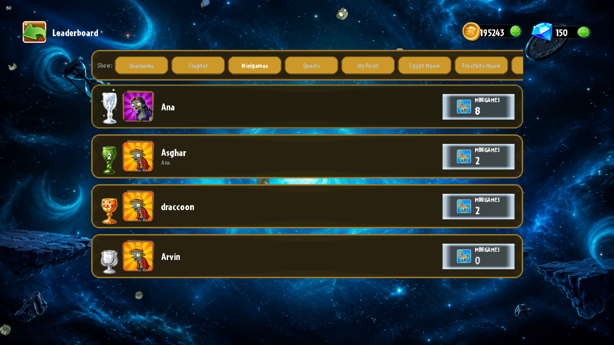
    </td>
    <td align="center">
      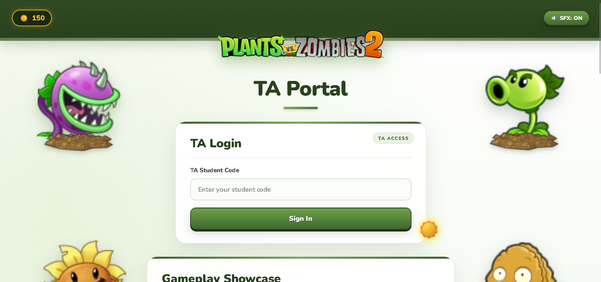
    </td>
  </tr>
</table>

---

## 🧟 Overview

This project reimplements Plants vs. Zombies 2 as a university Advanced Programming assignment, evolving through two major phases:

* **Phase 1** — A complete terminal-based game engine: plant/zombie logic, combat, wave spawning, level systems, user accounts, and progression — all driven by a command-line interface.
* **Phase 2** — A full graphical layer built on top of the existing engine using **LibGDX**, converting every terminal interaction into polished UI screens, animations, and real-time rendering — while deliberately keeping changes to the **Model** and **Controller** layers minimal, per the project spec.

The result is a genuine multi-chapter tower-defense game: **Egypt**, **Big Wave Beach**, **Dark Ages**, and **Frostbite Caves**, each with unique mechanics, hazards, and visual identity.

---

## 🌱 Architecture

Built on a strict **MVC** structure:

```text
model/         → Game state, entities, plants, zombies, levels, user data
view/          → LibGDX screens, renderers, UI components, animations
controller/    → Input handling, game loop control, screen navigation
service/       → Cross-cutting systems: parsing, email, asset management
resource/      → JSON configs, level data, asset paths
net/           → Client/server systems (TA grading portal, account sync)
```

**Design principles followed throughout:**

* Minimal, targeted changes — no rewrites where a small diff suffices
* Maximum inheritance and shared logic where refactors make sense
* Every new screen mirrors the structure of an existing, analogous screen
* Views stay dumb; game logic stays in the model/controller layers

---

## ⚔️ Core Systems

### 🌻 Plant & Zombie Engine

* Full roster of plants across multiple families (offensive, defensive, sun-producing, utility)
* Multi-type zombies with armor systems (cone, bucket, helmet, newspaper, knight's shoulder pad) that visually degrade with damage
* Custom **PAM animation system** (`TextureBank` / `PamPlayer`) driving idle, attack, and special-state animations for every entity

### 🗺️ World & Progression

* Chapter-based world map with per-chapter stage screens, all inheriting from a shared `StagesScreen` base — using shared enums (`LevelNodeState`, `DangerNodeState`) and template methods for chapter-specific variation
* Collection system (`CollectionManager`, `PlantJsonParser`) tracking unlocked plants/zombies, upgrade paths, and seed packet progress
* Full economy: coins, diamonds, shop, daily items, greenhouse growing mechanics
* Persistent local user data and account progress

### 🎮 Gameplay Modes

* Standard adventure levels (deadline, survival, protect-the-house)
* Conveyor-belt planting levels
* **Vasebreaker** and **Zombie Bowling** mini-games
* Boss fights (Zomboss) with multi-phase health bars and randomized attack patterns
* Online/network gameplay and multiplayer-related systems

### 🖥️ UI & Menus

* Full menu suite: login/signup, profile, leaderboard, settings, news, travel log
* Reusable `SeedPacketCardFactory` for consistent plant/zombie card rendering across collection, shop, and in-game plant-selection screens — avoiding duplicated UI logic across near-identical lists
* In-game HUD: sun counter, wave progress bar, plant food tracker, mission objectives

### 📧 TA Grading Portal

A standalone local web system (`net/server/ta/`) letting course TAs:

* Sign in with a secure, hashed access code
* Submit grade updates that instantly credit in-game currency to the correct account
* Trigger an automated, custom-styled **HTML thank-you email** via a self-contained `EmailSender` service (Jakarta Mail / SMTP) — with a graceful fallback flow when no email is on file

---

## ❄️ Chapter Highlights

| Chapter             | Signature Mechanic                                                      |
| ------------------- | ----------------------------------------------------------------------- |
| **Egypt**           | Ancient tombs and classic zombie waves                                  |
| **Big Wave Beach**  | Dynamic tide levels, low-tide zombie ambushes                           |
| **Dark Ages**       | Graves, necromancy zombie summons, torch-lit hazards                    |
| **Frostbite Caves** | Freezing winds, slippery ground, three-stage plant/zombie freeze states |

---

## 🐛 Engineering Highlights

A few of the harder problems solved along the way:

* **Fixed-timestep catch-up hang** — Diagnosed and capped an unbounded tick catch-up loop in the Vasebreaker render loop that could spiral into a CPU stall under load (`MAX_TICKS_PER_FRAME`)
* **Directional velocity bug** — A subtle `Math.abs()` sign error in the Jester/Juggler zombie's deflection logic that static analysis missed entirely — only caught by actually compiling and running the isolated behavior
* **LibGDX `Stack` gotcha** — Discovered that `rootStack.add()` silently forces every child to fill the screen on layout, eating touch input and overriding manual positioning — solved by using `stage.addActor()` for overlays instead
* **OOP unification** — Refactored four near-duplicate chapter map screens into a single inheritance hierarchy with shared enums and template methods, cutting significant code duplication while preserving each chapter's unique visual behavior
* **Portable persistence** — Moved client-side user data to a writable per-user application-data directory so saved accounts and progress do not depend on the installation directory

---

## 🛠️ Tech Stack

* **Language:** Java 16+
* **Graphics:** LibGDX (Scene2D UI, custom renderers, viewport-based camera handling)
* **Build:** Gradle
* **Data:** JSON-driven configuration for levels, plants, and zombies
* **Networking:** Lightweight embedded HTTP server for the TA grading portal
* **Email:** Jakarta Mail over SMTP, HTML templating for transactional messages
* **Desktop Packaging:** `jpackage` with a bundled Java runtime for Windows releases

---

## 🚀 Getting Started

The easiest way to run the game is through the latest published release.

### 🪟 Windows — Recommended

Download the latest Windows installer from GitHub Releases:

<p align="center">
  <a href="https://github.com/danielroods/PvZ-StrawHats/releases/latest">
    
  </a>
</p>

Run:

```text
PvZ-StrawHats-1.0.0.exe
```

The installer creates the desktop/start-menu entry configured for the application.

### 📦 Windows Portable Version

A portable Windows ZIP is also provided in the latest release:

```text
PvZ-StrawHats-v1.0.0-Windows.zip
```

Extract the ZIP and launch the packaged:

```text
PvZ-StrawHats.exe
```

No source checkout is required.

### ☕ Java Version

A Java distribution is provided for developers and users who prefer running the game with Java.

Download:

```text
PvZ-StrawHats-v1.0.0-Java.zip
```

It contains the runnable project JAR together with its required libraries, assets, and resources.

Run:

```text
Run-PvZ.bat
```

The current release build is produced with **JDK 25**.

The raw:

```text
PvZ-StrawHats-v1.0.0.jar
```

is also published as a separate release asset; the Java ZIP is the recommended way to run the Java version because it includes the required runtime dependencies and resources.

### 🧑‍💻 Build From Source

Requirements:

* JDK 25
* Git
* Windows for the packaged EXE release
* WiX Toolset 3.14+ for Windows installer generation

Clone the repository and run:

```powershell
.\gradlew.bat clean build -x checkstyleMain
```

Run the game directly with:

```powershell
.\gradlew.bat run
```

Create the desktop distribution with:

```powershell
.\gradlew.bat installDist
```

Create the JAR with:

```powershell
.\gradlew.bat jar
```

The desktop distribution is generated under:

```text
build/install/PvZ_StrawHats/
```

### 🧰 Windows Release Packaging

The Windows application image is created with `jpackage`, including the project's assets and JSON resources.

The final Windows installer is generated as:

```text
PvZ-StrawHats-1.0.0.exe
```

The release process packages:

* the game JAR
* LibGDX / LWJGL dependencies
* required native libraries
* game assets
* JSON configuration/resources
* a bundled Java runtime for the packaged Windows application

---

## 💾 Saved Data

Player accounts and local game progress are stored in the user's application-data directory rather than inside the installation folder.

On Windows, the client data file is stored at:

```text
%APPDATA%\PvZ_StrawHats\client-data\Data.json
```

This keeps saved data independent from the installation location and Windows shortcut used to launch the game.

---

## ⛵ The Crew

<p align="center">
  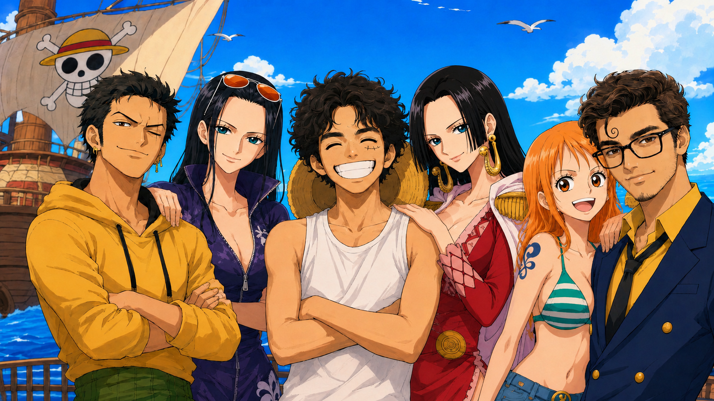
</p>

| Name                             | Student ID |
| -------------------------------- | ---------- |
| **Arvin Talebi**                 | 404106055  |
| **Erfan Salehi**                 | 404106033  |
| **Danial Roodsaraby** (draccoon) | 404105886  |

---

## 🌞 Status

The project has reached a playable graphical release state, with core gameplay, all four chapters, the main menu system, mini-games, boss content, persistent user data, and desktop packaging implemented.

The project remains in development, with ongoing visual polish and additional gameplay improvements.

---

## 📦 Releases

Playable builds are published through GitHub Releases in both repository locations:

<p align="center">
  <a href="https://github.com/danielroods/PvZ-StrawHats/releases/latest">
    
  </a>
  <br><br>
  <a href="https://github.com/advanced-progamming-sut-2026/phase-0-strawhats/releases/latest">
    
  </a>
</p>

Each release can contain the packaged Windows installer, portable Windows build, Java distribution, and raw JAR artifact.

---

<p align="center"><i>🌻 Plant smart. Mow often. Never let them reach the house. 🧟</i></p>
